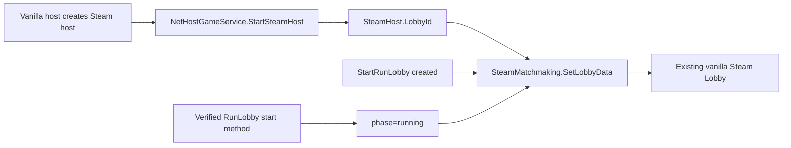

# SpireWatch Architecture

## Project Overview

SpireWatch extends an existing Slay the Spire 2 Steam multiplayer session. It must preserve the vanilla `Multiplayer -> Join Game` user flow and add only one allowed case: a compatible SpireWatch lobby whose run has started may be joined as a spectator.

The expected stack is a `net9.0` Godot mod referencing the game's `sts2.dll`, Harmony, and GodotSharp. The manifest declares a runtime dependency on STS2-RitsuLib; the first-stage network implementation uses direct game APIs because its work is at the multiplayer boundary.

## Current Repository Structure

| Path | Responsibility |
| --- | --- |
| `src/ModEntry.cs` | Mod initializer and Harmony registration. |
| `src/Networking/LobbyMetadata.cs` | Stable lobby metadata contract. |
| `src/Networking/SteamLobbyMetadataPublisher.cs` | Reflection bridge from vanilla host to `SteamMatchmaking.SetLobbyData`. |
| `src/Patches/HostLobbyPatches.cs` | Host/lobby lifecycle bindings confirmed by reference source. |
| `src/Patches/RunningLobbyLifecyclePatch.cs` | Fail-closed runtime resolver for the unconfirmed run-start method. |
| `runtime-validation.md` | Required assembly inspection and multiplayer test matrix. |
| `scripts/verify-static.sh` | Checks repository scope and Stage 0/1 artifacts without a game install. |

## Confirmed Runtime Flow

The first two bindings are supported by source inspection of the RMP reference: `NetHostGameService.StartSteamHost`, `StartRunLobby(GameMode, INetGameService, IStartRunLobbyListener, int)`, and `SteamHost.LobbyId` are used there. `SteamMatchmaking.SetLobbyData` is invoked reflectively, so the mod neither ships a Steamworks assembly nor creates a different transport.

The last binding is deliberately dynamic. The cited source establishes that `RunLobby` owns running-session handling, but the precise game-build run-start method has not been inspected in the target `sts2.dll`. On failure the mod leaves `phase=lobby`, logs the target failure, and does not expose a running lobby.

## Target End-to-End Flow

1. The host creates and starts a normal vanilla Steam multiplayer lobby.
2. SpireWatch writes `spirewatch`, protocol/version, spectator count, and phase keys to that same lobby.
3. A later list-query patch will include only `spirewatch=1` and `phase=running` entries alongside ordinary waiting lobbies; ordinary running lobbies retain vanilla behavior.
4. A later join patch sends running entries through a spectator handshake rather than vanilla player admission.
5. The host validates versions, creates a mod-only `SpectatorSession`, sends a `SerializableRun` snapshot at a safe synchronization point, then forwards compatible vanilla action synchronization.

## Module Boundaries

| Module | Owns | Must not own |
| --- | --- | --- |
| Lobby metadata | Steam Lobby discovery contract | player/session state, a second lobby |
| Join branch | route selection and compatibility refusal | vanilla player creation for spectators |
| Spectator registry | SteamId/NetId to `SpectatorSession` | `RunState.Players`, character slots |
| Snapshot bridge | safe-point snapshots and recovery | in-flight animation recovery |
| Read-only guard | UI and action/command rejection | host authoritative game mutation |

## Source Analysis Findings

The DirectConnectIP reference demonstrates `JoinFlow.Begin` returning `RunSessionState.Running` with `ClientRejoinResponseMessage.serializableRun`; it then uses `RunState.FromSerializable`, `LoadRunLobby`, `RunManager.SetUpSavedMultiplayer`, and `NGame.LoadRun` to restore the run. This is the intended starting point for Stage 3, but it cannot be copied blindly because its normal rejoin path assumes a vanilla player identity.

RMP demonstrates custom `INetMessage` registration through `INetGameService.RegisterMessageHandler<T>` and side-by-side protocol traffic. This supports the Stage 2 handshake design without replacing the vanilla connection service.

## Risks and Explicit Non-Goals

- Room-list internals, UI row data, and JoinFlow admission signatures are version-sensitive and must be read from the installed `sts2.dll` before patching.
- Publishing metadata alone does not make running rooms discoverable; the query/filter patch is pending assembly analysis.
- The dynamic running-state hook needs live verification for call timing and host-only execution.
- No HTTP, WebSocket, external backend, parallel lobby, chat, password, friend filter, kick action, or player impersonation is present.
