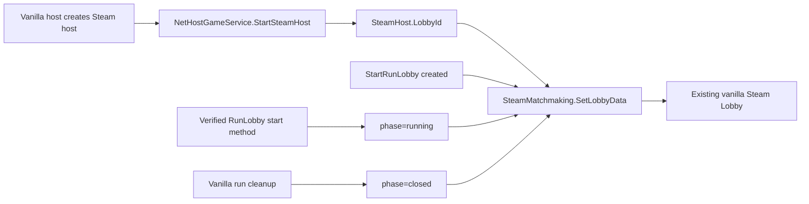

# SpireWatch Architecture

## Project Overview

SpireWatch extends an existing Slay the Spire 2 Steam multiplayer session. It preserves the vanilla `Multiplayer -> Join Game` user flow and adds one allowed case: a compatible SpireWatch lobby whose run has started may be joined as a spectator.

The current stack is a `net9.0` DLL Mod referencing the game's `sts2.dll`, Harmony, and GodotSharp. The first-stage network implementation uses direct game APIs because its work is at the multiplayer boundary.

## Current Repository Structure

| Path | Responsibility |
| --- | --- |
| `src/ModEntry.cs` | Mod initializer and Harmony registration. |
| `src/Networking/LobbyMetadata.cs` | Stable lobby metadata contract. |
| `src/Networking/SteamLobbyMetadataPublisher.cs` | Reflection bridge from vanilla host to `SteamMatchmaking.SetLobbyData`. |
| `src/Patches/HostLobbyPatches.cs` | Host/lobby lifecycle bindings confirmed by reference source. |
| `src/Patches/RunningLobbyLifecyclePatch.cs` | `v0.109.0` host run-start lifecycle binding. |
| `src/Patches/LobbyLifecycleSafetyPatches.cs` | Limits lobby retention to active host runs and clears the running marker during cleanup. |
| `src/Spectating/SpectatorProtocol.cs` | Host/client protocol challenge before running-session rejoin admission. |
| `src/Spectating/SpectatorJoinSafety.cs` | Conservative host-side safe-point gate. |
| `runtime-validation.md` | Required assembly inspection and multiplayer test matrix. |
| `scripts/verify-static.sh` | Checks repository scope and Stage 0/1 artifacts without a game install. |

## Confirmed Runtime Flow

The first two bindings are supported by source inspection of the RMP reference: `NetHostGameService.StartSteamHost`, `StartRunLobby(GameMode, INetGameService, IStartRunLobbyListener, int)`, and `SteamHost.LobbyId` are used there. `SteamMatchmaking.SetLobbyData` is invoked reflectively, so the mod neither ships a Steamworks assembly nor creates a different transport.

The last binding targets `StartRunLobby.BeginRunLocally`, verified against the local `v0.109.0` `sts2.dll`. The patch publishes `phase=running` only when the local service is the host.

## Target End-to-End Flow

1. The host creates and starts a normal vanilla Steam multiplayer lobby.
2. SpireWatch writes `spirewatch`, protocol/version, spectator count, and phase keys to that same lobby.
3. The friend-room patch includes only compatible `spirewatch=1` and `phase=running` entries in the spectator branch; ordinary waiting rooms retain vanilla joining and running rows carry `进行中 · 观战`.
4. A running-room click starts the versioned protocol challenge before the rejoin admission path.
5. The host validates the SpireWatch wire version and a conservative safe point before creating a mod-only `SpectatorSession` and sending a snapshot.
6. The client restores a read-only projection through the current vanilla UI bridge. This is an explicit temporary limitation: it still relies on an observed Player NetId and must be replaced by an independent spectator view.

## Module Boundaries

| Module | Owns | Must not own |
| --- | --- | --- |
| Lobby metadata | Steam Lobby discovery contract | player/session state, a second lobby |
| Join branch | route selection and compatibility refusal | vanilla player creation for spectators |
| Spectator registry | SteamId/NetId to `SpectatorSession` | `RunState.Players`, character slots |
| Snapshot bridge | safe-point snapshots and recovery | in-flight animation recovery |
| Read-only guard | UI and action/command rejection | host authoritative game mutation |

## Source Analysis Findings

The DirectConnectIP reference demonstrates `JoinFlow.Begin` returning `RunSessionState.Running` with `ClientRejoinResponseMessage.serializableRun`; it then uses `RunState.FromSerializable`, `LoadRunLobby`, `RunManager.SetUpSavedMultiplayer`, and `NGame.LoadRun` to restore the run. This is useful evidence for Stage 3, but its normal rejoin path assumes a vanilla player identity and is therefore not usable for SpireWatch unchanged.

RMP demonstrates custom `INetMessage` registration through `INetGameService.RegisterMessageHandler<T>` and side-by-side protocol traffic. This supports the Stage 2 handshake design without replacing the vanilla connection service.

## Risks and Explicit Non-Goals

- Room-list internals, UI row data, and JoinFlow admission signatures are version-sensitive and must be read from the installed `sts2.dll` before patching.
- The current safe-point gate rejects all active combat. Shop, reward, event and map recovery still require two-account visual verification.
- Lobby retention, protocol-message ordering, and cleanup timing need live Steam verification on the target game build.
- No HTTP, WebSocket, external backend, parallel lobby, chat, password, friend filter, kick action, or player impersonation is present.
